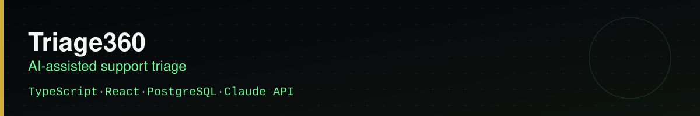
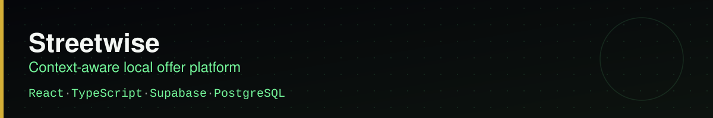
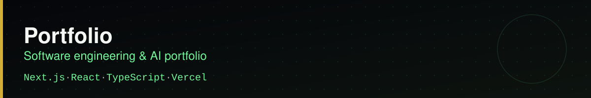

<table>
<tr>
<td width="180" valign="top">

</td>
<td valign="top">

### Hi, I'm Frank Ncube 👋

I like building software that solves real problems. I enjoy coding, working with AI, exploring cloud technologies, and turning ideas into products people can actually use.

I'm currently strengthening my software engineering skills while building projects across web development, applied AI, and cloud systems.

**Software Engineering · AI · Cloud · Product Development**

</td>
</tr>
</table>

## Technical toolkit

<table>
<tr>
<td width="50%" valign="top">

**Languages**
   

</td>
<td width="50%" valign="top">

**Frontend**
   

</td>
</tr>
<tr>
<td width="50%" valign="top">

**Backend & Data**
  

</td>
<td width="50%" valign="top">

**Cloud & Deployment**
 

</td>
</tr>
<tr>
<td width="50%" valign="top">

**AI**
  

</td>
<td width="50%" valign="top">

**Developer Tools**
  

</td>
</tr>
</table>

## Featured work

Classifies incoming tickets, evaluates escalation risk, retrieves relevant support documentation, and generates grounded AI responses or routes high-risk cases to a human.

Ranks merchants by situational relevance, demand, and proximity, then generates structured, time-limited offers with authentication and redemption flows.

Case studies, resume access, and engineering work spanning software, AI, and cloud projects.

## Profile snapshot

| Education | Current focus |
| --- | --- |
| **Livingstone College** B.S. Computer Information Sciences Expected December 2029 · GPA: 4.0/4.0 | Software Engineering Applied AI Cloud Systems Product Engineering |

Open to Software Engineering, AI, Cloud, and related opportunities.

---

[Portfolio](https://frank-ncube-portfolio.vercel.app) · [LinkedIn](https://www.linkedin.com/in/frank-ncube-417a52338) · [GitHub](https://github.com/Knarf24)

