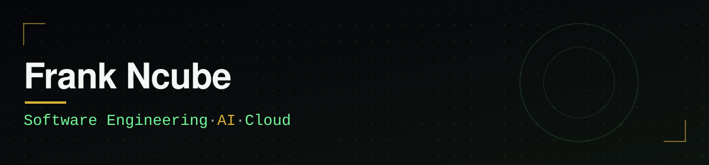

Computer Information Sciences student at Livingstone College building production-ready software for real users.

## About

I'm building a software engineering foundation while going deeper into applied AI, cloud systems, and product engineering. I like taking a real problem — not a hypothetical one — and turning it into software that works end to end: designed, built, tested, and shipped.

## Technical toolkit

| Category | Stack |
| --- | --- |
| **Languages** |     |
| **Frontend** |     |
| **Backend & Data** |    |
| **Cloud & Deployment** |   |
| **AI** |    |
| **Developer Tools** |    |

## Featured work

### [Triage360](https://github.com/Knarf24/support-triangle-agent)
AI-assisted support triage system that classifies incoming tickets, evaluates escalation risk across six categories, retrieves relevant support documentation, and generates grounded Claude-based responses or routes high-risk cases to a human.

`TypeScript` `React` `Express` `PostgreSQL` `Claude API` `Python`

### [Streetwise](https://github.com/Knarf24/streetwise-offer-ai)
Context-aware offer platform that ranks merchants using situational relevance, demand, proximity, and discount value, then generates structured, time-limited offers with authentication, persistence, and redemption flows.

`React` `TypeScript` `Supabase` `PostgreSQL` `Edge Functions` `AI`

### [Portfolio](https://github.com/Knarf24/frank-ncube-portfolio)
Production portfolio covering software engineering, AI, cloud, and product-development work, with a typed content architecture, automated verification, project case studies, and a deployed resume experience.

`Next.js` `React` `TypeScript` `Tailwind CSS` `Vitest` `Playwright` `Vercel`

## Education

**Livingstone College**
B.S. Computer Information Sciences · Expected December 2029 · GPA: 4.0/4.0

## Current direction

I am currently strengthening my software engineering foundation while expanding deeper into applied AI, cloud systems, and product engineering.

Open to Software Engineering, AI, Cloud, and related opportunities.

---

For detailed case studies and my resume, visit my **[portfolio](https://frank-ncube-portfolio.vercel.app)**.

[Portfolio](https://frank-ncube-portfolio.vercel.app) · [LinkedIn](https://www.linkedin.com/in/frank-ncube-417a52338) · [GitHub](https://github.com/Knarf24)

